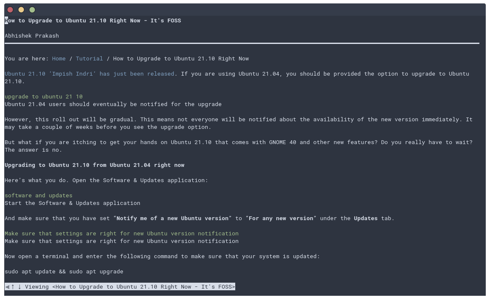

+++
title = "Newsboat with readability-cli"
description = "Open article in w3m and remove bloat with readability-cli"
date = "2021-10-27"
author = "Filip Havrlent"
+++

## Introduction

I tried a few RSS readers lately, but I was not really happy with how they looked or worked. I use Arch, btw, with Gnome, and I could not find any reader that would respect the system theme I use (Nord). So I decided to try out RSS reader in the console called [Newsboat](https://wiki.archlinux.org/title/Newsboat). You can view my Newsboat config in [here](https://github.com/fhavrlent/dotfiles/tree/main/private_dot_newsboat).

## Newsboat + readability-cli + w3m

After messing up with the Newsboat a bit, I decided to display articles straight in the terminal instead of opening them in the browser. To do that, you will need to install `w3m` and `readability-cli`. 

If you use Arch, just run

```bash
# pacman -Syu w3m readability-cli
```

Then, in `~/.newsboat/config` add line
```
macro r set browser "readable %u 2> /dev/null | w3m -T text/html" ; open-in-browser ; set browser "firefox %u"
```

Then open some article, press `,+r` and it will open w3m with the article with all the fluf removed.

